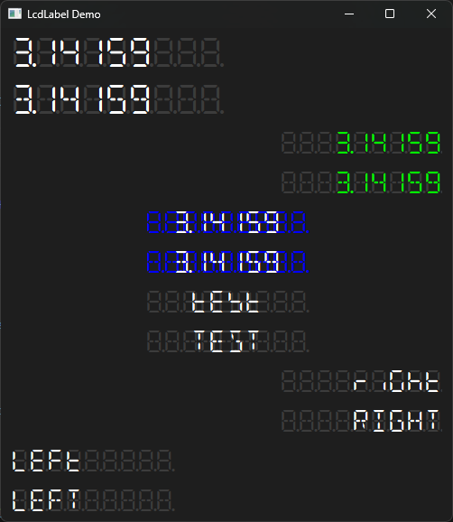

# LCDLABEL

This is a widget for PySide6 that allows one to emulate the looks of a transflective LCD-display.

## NOTES ON USE OF INCLUDED FONTS

If you wish to get a similar look as in the example, keep the foreground-text and background-text equal length and depending on whether you are using the 7-segment font or 14-segment font, use either `8` or `~` as the fill-character for the background-text. Do also note that space-character is not the same width as characters and letters -- use an exclamation mark (`!`) for a fixed-size space character. Colon and space have the same width, which is used to create the blinking effect in the example application. Dot (`.`) has no width, it can be used freely without breaking the alignment between the foreground- and background-text.

See [Keshikan's page](https://www.keshikan.net/fonts-e.html) for more details on the fonts and their peculiarities.

## TODO

* Fill out this README

## CREDITS

The [awesome LCD-fonts](https://www.keshikan.net/fonts-e.html) were created by Keshikan. Thanks, matey!
